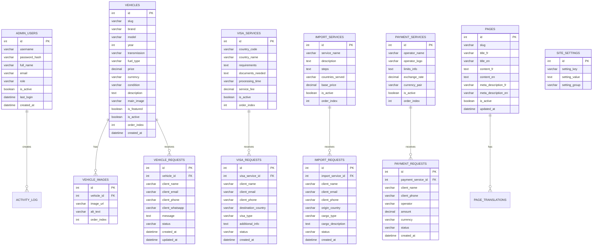
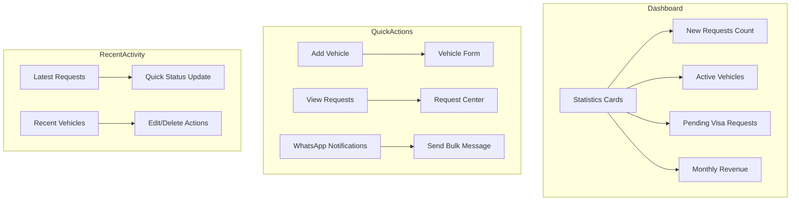

# 📋 SULOC CMS Development Plan

## Logistics & Administrative Services Platform

---

## 🎯 Executive Summary

This document outlines the comprehensive development plan for **Success Logistics Company (SULOC)** CMS - a custom content management system for logistics facilitation and administrative services. The platform will enable "no-code" management of services, vehicles, and client requests while projecting professionalism and trust.

### Key Objectives

- Build a fully customizable CMS based on the existing CICESE codebase patterns
- Enable 100% text and image modification without technical intervention
- Deliver a mobile-first experience optimized for 3G networks in Congo
- Integrate WhatsApp as a primary communication channel
- Support bilingual content (French/English)

---

## 🏢 SULOC Core Missions

The platform is structured around four key service pillars:

| Mission                       | Description                                                            | Icon               |
| ----------------------------- | ---------------------------------------------------------------------- | ------------------ |
| **Visa Assistance**           | Document preparation, verification, and guidance by visa type          | `fas fa-passport`  |
| **Logistics & Transport**     | Freight organization, shipment tracking, maritime/transit coordination | `fas fa-truck`     |
| **Administrative Consulting** | Reliable information for secure procedures and time optimization       | `fas fa-file-alt`  |
| **Professional Intermediary** | Official trust link between clients, partners, and institutions        | `fas fa-handshake` |

---

## 🎨 Brand Identity & Color Scheme

### Primary Colors (from SULOC Logo)

```css
:root {
  --suloc-navy: #0a2342; /* Primary - Professionalism & Authority */
  --suloc-gold: #d4af37; /* Accent - Success & Quality */
  --suloc-white: #ffffff; /* Clarity & Readability */
  --suloc-silver: #c0c0c0; /* Secondary accent */
  --suloc-navy-light: #1a3a5c; /* Hover states */
  --suloc-gold-dark: #b8962e; /* Active states */
}
```

### Typography

- **Headings**: Inter or Poppins (Bold, 700)
- **Body**: Inter or Open Sans (Regular, 400)
- **Accent**: Playfair Display for premium feel

---

## 🗄️ Database Architecture (12 Tables)

### Entity Relationship Diagram



### SQL Schema Creation Script

```sql
-- SULOC CMS Database Schema
-- Version 1.0

-- 1. Admin Users Table
CREATE TABLE admin_users (
    id INT AUTO_INCREMENT PRIMARY KEY,
    username VARCHAR(50) NOT NULL UNIQUE,
    password_hash VARCHAR(255) NOT NULL,
    full_name VARCHAR(100),
    email VARCHAR(100),
    role ENUM('super_admin', 'admin', 'editor') DEFAULT 'editor',
    is_active TINYINT(1) DEFAULT 1,
    last_login DATETIME,
    created_at DATETIME DEFAULT CURRENT_TIMESTAMP
) ENGINE=InnoDB DEFAULT CHARSET=utf8mb4;

-- 2. Vehicles Table
CREATE TABLE vehicles (
    id INT AUTO_INCREMENT PRIMARY KEY,
    slug VARCHAR(255) NOT NULL UNIQUE,
    brand VARCHAR(100) NOT NULL,
    model VARCHAR(100) NOT NULL,
    year INT,
    transmission ENUM('automatic', 'manual') DEFAULT 'automatic',
    fuel_type ENUM('petrol', 'diesel', 'hybrid', 'electric') DEFAULT 'petrol',
    price DECIMAL(15,2),
    currency VARCHAR(10) DEFAULT 'USD',
    vehicle_condition ENUM('new', 'used', 'certified') DEFAULT 'used',
    description TEXT,
    main_image VARCHAR(500),
    mileage INT,
    color VARCHAR(50),
    engine_size VARCHAR(20),
    doors INT DEFAULT 4,
    seats INT DEFAULT 5,
    is_featured TINYINT(1) DEFAULT 0,
    is_active TINYINT(1) DEFAULT 1,
    order_index INT DEFAULT 0,
    created_at DATETIME DEFAULT CURRENT_TIMESTAMP,
    updated_at DATETIME ON UPDATE CURRENT_TIMESTAMP
) ENGINE=InnoDB DEFAULT CHARSET=utf8mb4;

-- 3. Vehicle Images Table
CREATE TABLE vehicle_images (
    id INT AUTO_INCREMENT PRIMARY KEY,
    vehicle_id INT NOT NULL,
    image_url VARCHAR(500) NOT NULL,
    alt_text VARCHAR(255),
    order_index INT DEFAULT 0,
    FOREIGN KEY (vehicle_id) REFERENCES vehicles(id) ON DELETE CASCADE
) ENGINE=InnoDB DEFAULT CHARSET=utf8mb4;

-- 4. Visa Services Table
CREATE TABLE visa_services (
    id INT AUTO_INCREMENT PRIMARY KEY,
    country_code VARCHAR(3) NOT NULL,
    country_name_fr VARCHAR(100) NOT NULL,
    country_name_en VARCHAR(100),
    flag_icon VARCHAR(100),
    requirements_fr TEXT,
    requirements_en TEXT,
    documents_needed_fr TEXT,
    documents_needed_en TEXT,
    processing_time VARCHAR(50),
    service_fee DECIMAL(10,2),
    currency VARCHAR(10) DEFAULT 'USD',
    is_active TINYINT(1) DEFAULT 1,
    order_index INT DEFAULT 0,
    created_at DATETIME DEFAULT CURRENT_TIMESTAMP
) ENGINE=InnoDB DEFAULT CHARSET=utf8mb4;

-- 5. Import Services Table
CREATE TABLE import_services (
    id INT AUTO_INCREMENT PRIMARY KEY,
    service_name_fr VARCHAR(200) NOT NULL,
    service_name_en VARCHAR(200),
    slug VARCHAR(255) UNIQUE,
    description_fr TEXT,
    description_en TEXT,
    steps_fr TEXT,
    steps_en TEXT,
    countries_served TEXT,
    base_price DECIMAL(10,2),
    currency VARCHAR(10) DEFAULT 'USD',
    icon VARCHAR(50) DEFAULT 'fas fa-ship',
    is_active TINYINT(1) DEFAULT 1,
    order_index INT DEFAULT 0,
    created_at DATETIME DEFAULT CURRENT_TIMESTAMP
) ENGINE=InnoDB DEFAULT CHARSET=utf8mb4;

-- 6. Payment Services Table
CREATE TABLE payment_services (
    id INT AUTO_INCREMENT PRIMARY KEY,
    operator_name VARCHAR(100) NOT NULL,
    operator_logo VARCHAR(500),
    description_fr TEXT,
    description_en TEXT,
    limits_info_fr TEXT,
    limits_info_en TEXT,
    daily_limit DECIMAL(15,2),
    monthly_limit DECIMAL(15,2),
    exchange_rate DECIMAL(10,4),
    currency_pair VARCHAR(20),
    is_active TINYINT(1) DEFAULT 1,
    order_index INT DEFAULT 0,
    created_at DATETIME DEFAULT CURRENT_TIMESTAMP
) ENGINE=InnoDB DEFAULT CHARSET=utf8mb4;

-- 7. Vehicle Requests Table
CREATE TABLE vehicle_requests (
    id INT AUTO_INCREMENT PRIMARY KEY,
    vehicle_id INT,
    client_name VARCHAR(100) NOT NULL,
    client_email VARCHAR(100),
    client_phone VARCHAR(50) NOT NULL,
    client_whatsapp VARCHAR(50),
    message TEXT,
    status ENUM('new', 'in_progress', 'completed', 'cancelled') DEFAULT 'new',
    admin_notes TEXT,
    created_at DATETIME DEFAULT CURRENT_TIMESTAMP,
    updated_at DATETIME ON UPDATE CURRENT_TIMESTAMP,
    FOREIGN KEY (vehicle_id) REFERENCES vehicles(id) ON DELETE SET NULL
) ENGINE=InnoDB DEFAULT CHARSET=utf8mb4;

-- 8. Visa Requests Table
CREATE TABLE visa_requests (
    id INT AUTO_INCREMENT PRIMARY KEY,
    visa_service_id INT,
    client_name VARCHAR(100) NOT NULL,
    client_email VARCHAR(100),
    client_phone VARCHAR(50) NOT NULL,
    client_whatsapp VARCHAR(50),
    destination_country VARCHAR(100),
    visa_type VARCHAR(100),
    travel_date DATE,
    additional_info TEXT,
    status ENUM('new', 'in_progress', 'completed', 'cancelled') DEFAULT 'new',
    admin_notes TEXT,
    created_at DATETIME DEFAULT CURRENT_TIMESTAMP,
    updated_at DATETIME ON UPDATE CURRENT_TIMESTAMP,
    FOREIGN KEY (visa_service_id) REFERENCES visa_services(id) ON DELETE SET NULL
) ENGINE=InnoDB DEFAULT CHARSET=utf8mb4;

-- 9. Import Requests Table
CREATE TABLE import_requests (
    id INT AUTO_INCREMENT PRIMARY KEY,
    import_service_id INT,
    client_name VARCHAR(100) NOT NULL,
    client_email VARCHAR(100),
    client_phone VARCHAR(50) NOT NULL,
    client_whatsapp VARCHAR(50),
    origin_country VARCHAR(100),
    destination_country VARCHAR(100),
    cargo_type VARCHAR(100),
    cargo_description TEXT,
    estimated_weight VARCHAR(50),
    status ENUM('new', 'in_progress', 'completed', 'cancelled') DEFAULT 'new',
    admin_notes TEXT,
    created_at DATETIME DEFAULT CURRENT_TIMESTAMP,
    updated_at DATETIME ON UPDATE CURRENT_TIMESTAMP,
    FOREIGN KEY (import_service_id) REFERENCES import_services(id) ON DELETE SET NULL
) ENGINE=InnoDB DEFAULT CHARSET=utf8mb4;

-- 10. Payment Requests Table
CREATE TABLE payment_requests (
    id INT AUTO_INCREMENT PRIMARY KEY,
    payment_service_id INT,
    client_name VARCHAR(100) NOT NULL,
    client_phone VARCHAR(50) NOT NULL,
    client_whatsapp VARCHAR(50),
    operator VARCHAR(100),
    amount DECIMAL(15,2),
    currency VARCHAR(10),
    transaction_type ENUM('send', 'receive', 'exchange') DEFAULT 'send',
    status ENUM('new', 'in_progress', 'completed', 'cancelled') DEFAULT 'new',
    admin_notes TEXT,
    created_at DATETIME DEFAULT CURRENT_TIMESTAMP,
    updated_at DATETIME ON UPDATE CURRENT_TIMESTAMP,
    FOREIGN KEY (payment_service_id) REFERENCES payment_services(id) ON DELETE SET NULL
) ENGINE=InnoDB DEFAULT CHARSET=utf8mb4;

-- 11. Pages Table (Editable Content)
CREATE TABLE pages (
    id INT AUTO_INCREMENT PRIMARY KEY,
    slug VARCHAR(100) NOT NULL UNIQUE,
    title_fr VARCHAR(255) NOT NULL,
    title_en VARCHAR(255),
    content_fr LONGTEXT,
    content_en LONGTEXT,
    meta_description_fr VARCHAR(500),
    meta_description_en VARCHAR(500),
    featured_image VARCHAR(500),
    is_active TINYINT(1) DEFAULT 1,
    created_at DATETIME DEFAULT CURRENT_TIMESTAMP,
    updated_at DATETIME ON UPDATE CURRENT_TIMESTAMP
) ENGINE=InnoDB DEFAULT CHARSET=utf8mb4;

-- 12. Site Settings Table
CREATE TABLE site_settings (
    id INT AUTO_INCREMENT PRIMARY KEY,
    setting_key VARCHAR(100) NOT NULL UNIQUE,
    setting_value TEXT,
    setting_group VARCHAR(50) DEFAULT 'general',
    setting_type ENUM('text', 'textarea', 'image', 'boolean', 'json') DEFAULT 'text',
    created_at DATETIME DEFAULT CURRENT_TIMESTAMP,
    updated_at DATETIME ON UPDATE CURRENT_TIMESTAMP
) ENGINE=InnoDB DEFAULT CHARSET=utf8mb4;

-- Default Settings
INSERT INTO site_settings (setting_key, setting_value, setting_group) VALUES
('site_name', 'SULOC', 'general'),
('site_tagline_fr', 'Success Logistics Company', 'general'),
('site_tagline_en', 'Success Logistics Company', 'general'),
('phone_primary', '+25762400920', 'contact'),
('phone_whatsapp', '+25762400920', 'contact'),
('email_primary', 'contact@suloc.com', 'contact'),
('address', 'Bujumbura, Burundi', 'contact'),
('facebook_url', '', 'social'),
('instagram_url', '', 'social'),
('linkedin_url', '', 'social'),
('whatsapp_message', 'Bonjour SULOC, je souhaite des informations sur...', 'whatsapp');

-- Default Admin User (password: admin123 - CHANGE IN PRODUCTION!)
INSERT INTO admin_users (username, password_hash, full_name, email, role) VALUES
('admin', '$2y$10$92IXUNpkjO0rOQ5byMi.Ye4oKoEa3Ro9llC/.og/at2.uheWG/igi', 'Administrateur SULOC', 'admin@suloc.com', 'super_admin');
```

---

## 🏗️ System Architecture

### File Structure

```
suloc/
├── index.php                    # Homepage
├── vehicles.php                 # Vehicle catalog
├── vehicle-detail.php           # Single vehicle page
├── visa.php                     # Visa services hub
├── logistics.php                # Import/logistics services
├── payments.php                 # Payment services guide
├── contact.php                  # Contact page
├── .htaccess                    # URL rewriting & security
├── .env                         # Environment variables
│
├── admin/
│   ├── index.php                # Dashboard
│   ├── login.php                # Authentication
│   ├── logout.php               # Session termination
│   ├── vehicles.php             # Vehicle management
│   ├── vehicle-images.php       # Multi-image upload
│   ├── visa-services.php        # Visa services management
│   ├── import-services.php      # Import services management
│   ├── payment-services.php     # Payment services management
│   ├── requests/
│   │   ├── index.php            # All requests dashboard
│   │   ├── vehicle-requests.php # Vehicle inquiries
│   │   ├── visa-requests.php    # Visa requests
│   │   ├── import-requests.php  # Import requests
│   │   └── payment-requests.php # Payment requests
│   ├── pages.php                # Content pages editor
│   ├── settings.php             # Site settings
│   ├── upload-image.php         # Image upload handler
│   └── includes/
│       ├── admin-header.php     # Admin navigation
│       ├── admin-footer.php     # Admin footer
│       └── sidebar.php          # Admin sidebar
│
├── config/
│   ├── config.php               # Main configuration
│   ├── database.php             # Database connection
│   └── env.php                  # Environment loader
│
├── includes/
│   ├── header.php               # Public header
│   ├── footer.php               # Public footer
│   ├── whatsapp-widget.php      # WhatsApp floating button
│   ├── language-switcher.php    # FR/EN toggle
│   └── submit-handlers/
│       ├── vehicle-inquiry.php
│       ├── visa-request.php
│       ├── import-request.php
│       └── payment-request.php
│
├── css/
│   ├── main.css                 # Main stylesheet
│   ├── admin.css                # Admin panel styles
│   └── mobile.css               # Mobile optimizations
│
├── js/
│   ├── main.js                  # Main scripts
│   ├── forms.js                 # Form handling
│   ├── gallery.js               # Image gallery
│   ├── filters.js               # Vehicle filters
│   └── whatsapp.js              # WhatsApp integration
│
├── uploads/
│   ├── vehicles/                # Vehicle images
│   ├── services/                # Service images
│   ├── operators/               # Payment operator logos
│   └── pages/                   # Page content images
│
└── lib/
    └── PHPMailer/               # Email library
```

---

## 📱 Admin Backoffice Architecture

### Dashboard Overview



### Admin Navigation Structure

| Section       | Icon                     | Description                  |
| ------------- | ------------------------ | ---------------------------- |
| Dashboard     | `fas fa-tachometer-alt`  | Overview & statistics        |
| Vehicles      | `fas fa-car`             | Vehicle inventory management |
| Visa Services | `fas fa-passport`        | Visa requirements by country |
| Logistics     | `fas fa-ship`            | Import/export services       |
| Payments      | `fas fa-money-bill-wave` | Mobile money operators       |
| Requests      | `fas fa-inbox`           | All client requests          |
| Pages         | `fas fa-file-alt`        | Editable content pages       |
| Settings      | `fas fa-cog`             | Site configuration           |

### Vehicle Management Features

1. **Add/Edit Vehicle Form**

   - Brand, Model, Year selection
   - Price with currency selector
   - Transmission type (Auto/Manual)
   - Fuel type dropdown
   - Condition (New/Used/Certified)
   - Multi-image upload with drag & drop
   - Featured vehicle toggle
   - Active/Inactive status

2. **Image Gallery Management**

   - Drag & drop reordering
   - Bulk upload support
   - Image compression (< 200KB)
   - Alt text for SEO
   - Main image selection

3. **Request Center**
   - Unified inbox for all request types
   - Status workflow: New → In Progress → Completed
   - WhatsApp quick reply button
   - Export to CSV/Excel
   - Filter by date, status, type

---

## 🌐 Public Frontend Architecture

### Homepage Sections

```mermaid
flowchart TB
    subgraph Hero
        A[Hero Banner] --> B[Company Tagline]
        A --> C[CTA Buttons]
        A --> D[WhatsApp Quick Contact]
    end

    subgraph ServicesSlideshow
        SS[Auto-rotating Slideshow] --> S1[Visa Assistance Slide]
        SS --> S2[Logistics Slide]
        SS --> S3[Admin Consulting Slide]
        SS --> S4[Vehicle Import Slide]
        S1 --> BTN1[Go to Visa Page]
        S2 --> BTN2[Go to Logistics Page]
        S3 --> BTN3[Go to Consulting Page]
        S4 --> BTN4[Go to Vehicles Page]
    end

    subgraph Missions
        E[4 Mission Cards] --> F[Visa Assistance]
        E --> G[Logistics]
        E --> H[Admin Consulting]
        E --> I[Professional Intermediary]
    end

    subgraph FeaturedVehicles
        J[Vehicle Carousel] --> K[Featured Cars]
        J --> L[View All Button]
    end

    subgraph Services
        M[Service Overview] --> N[Quick Links]
    end

    subgraph Contact
        O[Contact Form] --> P[WhatsApp Integration]
        O --> Q[Location Map]
    end

    subgraph FloatingWidgets
        W1[WhatsApp Floating Button] --> W2[Click to Chat]
        W3[Back to Top Button]
    end
```



---

### 🎠 Services Slideshow Component

The homepage will feature a prominent auto-rotating slideshow showcasing SULOC's main services with navigation buttons to each service page.

#### Slideshow Specifications

| Feature               | Description                                     |
| --------------------- | ----------------------------------------------- |
| **Auto-rotation**     | 5-second intervals between slides               |
| **Manual Navigation** | Dots and arrows for manual control              |
| **Pause on Hover**    | Stops auto-rotation when user hovers            |
| **Touch Support**     | Swipe gestures on mobile devices                |
| **Responsive**        | Full-width on all screen sizes                  |
| **Service Buttons**   | Each slide has a CTA button to its service page |
| **WhatsApp Button**   | Secondary button for instant contact            |

#### Slide Content Structure

Each slide contains:

1. **Background Image** - High-quality service-related image (optimized < 200KB)
2. **Overlay** - Semi-transparent navy blue (#0A2342) overlay for text readability
3. **Service Icon** - Font Awesome icon representing the service
4. **Service Title** - Bold heading in white
5. **Service Description** - Brief 2-line description
6. **CTA Button** - Gold (#D4AF37) button redirecting to service page
7. **WhatsApp Button** - Green button for instant contact

#### Slides Configuration

| Slide | Service                | Icon              | Target Page      | WhatsApp Message                          |
| ----- | ---------------------- | ----------------- | ---------------- | ----------------------------------------- |
| 1     | Assistance Visa        | `fas fa-passport` | `visa.php`       | "Je souhaite des infos sur les visas"     |
| 2     | Logistique & Transport | `fas fa-ship`     | `logistics.php`  | "Je souhaite des infos sur la logistique" |
| 3     | Conseil Administratif  | `fas fa-file-alt` | `consulting.php` | "Je souhaite un conseil administratif"    |
| 4     | Import Véhicules       | `fas fa-car`      | `vehicles.php`   | "Je souhaite importer un véhicule"        |

#### Slideshow HTML Structure

```html
<!-- Services Slideshow -->
<section class="services-slideshow" id="services-slideshow">
  <!-- Slide 1: Visa Assistance -->
  <div class="slide active" data-service="visa">
    <div
      class="slide-bg"
      style="background-image: url'uploads/slides/visa-bg.jpg'"
    ></div>
    <div class="slide-overlay"></div>
    <div class="slide-content">
      <div class="slide-icon">
        <i class="fas fa-passport"></i>
      </div>
      <h2>Assistance Visa</h2>
      <p>
        Préparation de dossiers, vérification documentaire et orientation selon
        le type de visa
      </p>
      <div class="slide-buttons">
        <a href="visa.php" class="btn-gold">
          <i class="fas fa-arrow-right"></i> Découvrir nos services
        </a>
        <a
          href="#"
          class="btn-whatsapp"
          data-message="Je souhaite des informations sur les visas"
        >
          <i class="fab fa-whatsapp"></i> Contacter sur WhatsApp
        </a>
      </div>
    </div>
  </div>

  <!-- Slide 2: Logistics -->
  <div class="slide" data-service="logistics">
    <div
      class="slide-bg"
      style="background-image: url'uploads/slides/logistics-bg.jpg'"
    ></div>
    <div class="slide-overlay"></div>
    <div class="slide-content">
      <div class="slide-icon">
        <i class="fas fa-ship"></i>
      </div>
      <h2>Logistique & Transport</h2>
      <p>
        Organisation du fret, suivi des expéditions et coordination avec les
        partenaires maritimes
      </p>
      <div class="slide-buttons">
        <a href="logistics.php" class="btn-gold">
          <i class="fas fa-arrow-right"></i> Voir nos solutions
        </a>
        <a
          href="#"
          class="btn-whatsapp"
          data-message="Je souhaite des informations sur la logistique"
        >
          <i class="fab fa-whatsapp"></i> Contacter sur WhatsApp
        </a>
      </div>
    </div>
  </div>

  <!-- Slide 3: Administrative Consulting -->
  <div class="slide" data-service="consulting">
    <div
      class="slide-bg"
      style="background-image: url'uploads/slides/consulting-bg.jpg'"
    ></div>
    <div class="slide-overlay"></div>
    <div class="slide-content">
      <div class="slide-icon">
        <i class="fas fa-file-alt"></i>
      </div>
      <h2>Conseil Administratif</h2>
      <p>
        Informations fiables pour sécuriser vos démarches et optimiser votre
        temps
      </p>
      <div class="slide-buttons">
        <a href="consulting.php" class="btn-gold">
          <i class="fas fa-arrow-right"></i> Demander un conseil
        </a>
        <a
          href="#"
          class="btn-whatsapp"
          data-message="Je souhaite un conseil administratif"
        >
          <i class="fab fa-whatsapp"></i> Contacter sur WhatsApp
        </a>
      </div>
    </div>
  </div>

  <!-- Slide 4: Vehicle Import -->
  <div class="slide" data-service="vehicles">
    <div
      class="slide-bg"
      style="background-image: url'uploads/slides/vehicles-bg.jpg'"
    ></div>
    <div class="slide-overlay"></div>
    <div class="slide-content">
      <div class="slide-icon">
        <i class="fas fa-car"></i>
      </div>
      <h2>Import de Véhicules</h2>
      <p>Large sélection de véhicules importés avec accompagnement complet</p>
      <div class="slide-buttons">
        <a href="vehicles.php" class="btn-gold">
          <i class="fas fa-arrow-right"></i> Voir le catalogue
        </a>
        <a
          href="#"
          class="btn-whatsapp"
          data-message="Je souhaite importer un véhicule"
        >
          <i class="fab fa-whatsapp"></i> Contacter sur WhatsApp
        </a>
      </div>
    </div>
  </div>

  <!-- Navigation Arrows -->
  <button class="slideshow-arrow prev" aria-label="Previous slide">
    <i class="fas fa-chevron-left"></i>
  </button>
  <button class="slideshow-arrow next" aria-label="Next slide">
    <i class="fas fa-chevron-right"></i>
  </button>

  <!-- Navigation Dots -->
  <div class="slideshow-dots">
    <button
      class="dot active"
      data-slide="0"
      aria-label="Go to slide 1"
    ></button>
    <button class="dot" data-slide="1" aria-label="Go to slide 2"></button>
    <button class="dot" data-slide="2" aria-label="Go to slide 3"></button>
    <button class="dot" data-slide="3" aria-label="Go to slide 4"></button>
  </div>
</section>
```

#### Slideshow CSS

```css
/* Services Slideshow Styles */
.services-slideshow {
  position: relative;
  width: 100%;
  height: 500px;
  overflow: hidden;
  background-color: var(--suloc-navy);
}

@media (max-width: 768px) {
  .services-slideshow {
    height: 450px;
  }
}

.slide {
  position: absolute;
  width: 100%;
  height: 100%;
  opacity: 0;
  visibility: hidden;
  transition: opacity 0.8s ease-in-out, visibility 0.8s;
}

.slide.active {
  opacity: 1;
  visibility: visible;
}

.slide-bg {
  position: absolute;
  inset: 0;
  background-size: cover;
  background-position: center;
  background-repeat: no-repeat;
}

.slide-overlay {
  position: absolute;
  inset: 0;
  background: linear-gradient(
    135deg,
    rgba(10, 35, 66, 0.9),
    rgba(10, 35, 66, 0.7)
  );
}

.slide-content {
  position: relative;
  z-index: 10;
  display: flex;
  flex-direction: column;
  justify-content: center;
  align-items: center;
  height: 100%;
  text-align: center;
  color: white;
  padding: 2rem;
  max-width: 800px;
  margin: 0 auto;
}

.slide-icon {
  width: 80px;
  height: 80px;
  background: var(--suloc-gold);
  border-radius: 50%;
  display: flex;
  align-items: center;
  justify-content: center;
  margin-bottom: 1.5rem;
}

.slide-icon i {
  font-size: 2.5rem;
  color: var(--suloc-navy);
}

.slide-content h2 {
  font-size: 2.5rem;
  font-weight: 700;
  margin-bottom: 1rem;
  text-shadow: 2px 2px 4px rgba(0, 0, 0, 0.3);
}

@media (max-width: 768px) {
  .slide-content h2 {
    font-size: 1.8rem;
  }
}

.slide-content p {
  font-size: 1.2rem;
  opacity: 0.9;
  margin-bottom: 2rem;
  max-width: 600px;
}

.slide-buttons {
  display: flex;
  gap: 1rem;
  flex-wrap: wrap;
  justify-content: center;
}

.btn-gold {
  background-color: var(--suloc-gold);
  color: var(--suloc-navy);
  padding: 1rem 2rem;
  border-radius: 50px;
  font-weight: 700;
  text-decoration: none;
  transition: all 0.3s ease;
  display: inline-flex;
  align-items: center;
  gap: 0.5rem;
}

.btn-gold:hover {
  background-color: #b8962e;
  transform: translateY(-2px);
  box-shadow: 0 4px 15px rgba(212, 175, 55, 0.4);
}

.btn-whatsapp {
  background-color: #25d366;
  color: white;
  padding: 1rem 2rem;
  border-radius: 50px;
  font-weight: 700;
  text-decoration: none;
  transition: all 0.3s ease;
  display: inline-flex;
  align-items: center;
  gap: 0.5rem;
}

.btn-whatsapp:hover {
  background-color: #128c7e;
  transform: translateY(-2px);
}

/* Navigation Arrows */
.slideshow-arrow {
  position: absolute;
  top: 50%;
  transform: translateY(-50%);
  background: rgba(255, 255, 255, 0.2);
  border: none;
  color: white;
  width: 50px;
  height: 50px;
  border-radius: 50%;
  cursor: pointer;
  transition: all 0.3s;
  z-index: 20;
}

.slideshow-arrow:hover {
  background: var(--suloc-gold);
  color: var(--suloc-navy);
}

.slideshow-arrow.prev {
  left: 20px;
}

.slideshow-arrow.next {
  right: 20px;
}

@media (max-width: 768px) {
  .slideshow-arrow {
    width: 40px;
    height: 40px;
  }
  .slideshow-arrow.prev {
    left: 10px;
  }
  .slideshow-arrow.next {
    right: 10px;
  }
}

/* Navigation Dots */
.slideshow-dots {
  position: absolute;
  bottom: 20px;
  left: 50%;
  transform: translateX(-50%);
  display: flex;
  gap: 10px;
  z-index: 20;
}

.dot {
  width: 12px;
  height: 12px;
  border-radius: 50%;
  background: rgba(255, 255, 255, 0.5);
  border: none;
  cursor: pointer;
  transition: all 0.3s;
}

.dot:hover,
.dot.active {
  background: var(--suloc-gold);
  transform: scale(1.2);
}
```

#### Slideshow JavaScript

```javascript
/**
 * SULOC Services Slideshow
 * Auto-rotating slideshow with navigation and WhatsApp integration
 */
class ServicesSlideshow {
  constructor(container) {
    this.container = container;
    this.slides = container.querySelectorAll(".slide");
    this.dots = container.querySelectorAll(".dot");
    this.prevBtn = container.querySelector(".slideshow-arrow.prev");
    this.nextBtn = container.querySelector(".slideshow-arrow.next");
    this.currentIndex = 0;
    this.interval = null;
    this.autoPlayDelay = 5000; // 5 seconds
    this.whatsappNumber = "+25762400920"; // SULOC WhatsApp number

    this.init();
  }

  init() {
    this.addEventListeners();
    this.startAutoPlay();
    this.initWhatsAppButtons();
  }

  goToSlide(index) {
    // Remove active class from current slide and dot
    this.slides[this.currentIndex].classList.remove("active");
    this.dots[this.currentIndex].classList.remove("active");

    // Update index
    this.currentIndex = index;

    // Add active class to new slide and dot
    this.slides[this.currentIndex].classList.add("active");
    this.dots[this.currentIndex].classList.add("active");
  }

  nextSlide() {
    const next = (this.currentIndex + 1) % this.slides.length;
    this.goToSlide(next);
  }

  prevSlide() {
    const prev =
      (this.currentIndex - 1 + this.slides.length) % this.slides.length;
    this.goToSlide(prev);
  }

  startAutoPlay() {
    this.stopAutoPlay(); // Clear any existing interval
    this.interval = setInterval(() => this.nextSlide(), this.autoPlayDelay);
  }

  stopAutoPlay() {
    if (this.interval) {
      clearInterval(this.interval);
      this.interval = null;
    }
  }

  addEventListeners() {
    // Arrow buttons
    this.prevBtn.addEventListener("click", () => {
      this.prevSlide();
      this.startAutoPlay(); // Reset timer
    });

    this.nextBtn.addEventListener("click", () => {
      this.nextSlide();
      this.startAutoPlay(); // Reset timer
    });

    // Dot navigation
    this.dots.forEach((dot, index) => {
      dot.addEventListener("click", () => {
        this.goToSlide(index);
        this.startAutoPlay(); // Reset timer
      });
    });

    // Pause on hover
    this.container.addEventListener("mouseenter", () => this.stopAutoPlay());
    this.container.addEventListener("mouseleave", () => this.startAutoPlay());

    // Touch swipe support for mobile
    let touchStartX = 0;
    let touchEndX = 0;

    this.container.addEventListener(
      "touchstart",
      (e) => {
        touchStartX = e.touches[0].clientX;
      },
      { passive: true }
    );

    this.container.addEventListener(
      "touchend",
      (e) => {
        touchEndX = e.changedTouches[0].clientX;
        const diff = touchStartX - touchEndX;

        if (Math.abs(diff) > 50) {
          // Minimum swipe distance
          if (diff > 0) {
            this.nextSlide();
          } else {
            this.prevSlide();
          }
          this.startAutoPlay();
        }
      },
      { passive: true }
    );

    // Keyboard navigation
    document.addEventListener("keydown", (e) => {
      if (e.key === "ArrowLeft") {
        this.prevSlide();
        this.startAutoPlay();
      } else if (e.key === "ArrowRight") {
        this.nextSlide();
        this.startAutoPlay();
      }
    });
  }

  initWhatsAppButtons() {
    const whatsappBtns = this.container.querySelectorAll(".btn-whatsapp");

    whatsappBtns.forEach((btn) => {
      btn.addEventListener("click", (e) => {
        e.preventDefault();
        const message =
          btn.dataset.message || "Bonjour SULOC, je souhaite des informations";
        const encodedMessage = encodeURIComponent(message);
        const whatsappUrl = `https://wa.me/${this.whatsappNumber.replace(
          /[^0-9]/g,
          ""
        )}?text=${encodedMessage}`;
        window.open(whatsappUrl, "_blank");
      });
    });
  }
}

// Initialize slideshow when DOM is ready
document.addEventListener("DOMContentLoaded", () => {
  const slideshowContainer = document.querySelector(".services-slideshow");
  if (slideshowContainer) {
    new ServicesSlideshow(slideshowContainer);
  }
});
```

---

### 💬 Floating WhatsApp Button

A persistent WhatsApp button will be displayed on all pages for instant contact:

```html
<!-- Floating WhatsApp Button -->
<div class="whatsapp-float" id="whatsapp-float">
  <a
    href="#"
    class="whatsapp-btn"
    id="whatsapp-btn"
    aria-label="Contact us on WhatsApp"
  >
    <i class="fab fa-whatsapp"></i>
    <span class="whatsapp-tooltip">Chattez avec nous!</span>
  </a>
</div>
```

```css
/* Floating WhatsApp Button */
.whatsapp-float {
  position: fixed;
  bottom: 30px;
  right: 30px;
  z-index: 1000;
}

.whatsapp-btn {
  display: flex;
  align-items: center;
  justify-content: center;
  width: 60px;
  height: 60px;
  background-color: #25d366;
  border-radius: 50%;
  color: white;
  font-size: 2rem;
  box-shadow: 0 4px 15px rgba(37, 211, 102, 0.4);
  transition: all 0.3s ease;
  animation: pulse 2s infinite;
}

.whatsapp-btn:hover {
  transform: scale(1.1);
  box-shadow: 0 6px 20px rgba(37, 211, 102, 0.6);
}

.whatsapp-tooltip {
  position: absolute;
  right: 70px;
  background: var(--suloc-navy);
  color: white;
  padding: 8px 15px;
  border-radius: 5px;
  font-size: 0.9rem;
  white-space: nowrap;
  opacity: 0;
  visibility: hidden;
  transition: all 0.3s;
}

.whatsapp-btn:hover .whatsapp-tooltip {
  opacity: 1;
  visibility: visible;
}

@keyframes pulse {
  0% {
    box-shadow: 0 0 0 0 rgba(37, 211, 102, 0.7);
  }
  70% {
    box-shadow: 0 0 0 15px rgba(37, 211, 102, 0);
  }
  100% {
    box-shadow: 0 0 0 0 rgba(37, 211, 102, 0);
  }
}

@media (max-width: 768px) {
  .whatsapp-float {
    bottom: 20px;
    right: 20px;
  }
  .whatsapp-btn {
    width: 55px;
    height: 55px;
  }
  .whatsapp-tooltip {
    display: none;
  }
}
```

---

### Vehicle Catalog Features

1. **Advanced Filters**

   - Price range slider
   - Brand multi-select
   - Transmission type
   - Fuel type
   - Year range
   - Condition

2. **Sorting Options**

   - Price (Low to High / High to Low)
   - Newest First
   - Most Popular

3. **Vehicle Card Display**
   - Main image with hover gallery
   - Key specs (Year, Transmission, Fuel)
   - Price with currency
   - WhatsApp inquiry button
   - Quick view modal

### Visa Hub Features

1. **Country Selection**

   - Flag icons for visual identification
   - Search by country name
   - Popular destinations highlighted

2. **Requirements Display**
   - Document checklist
   - Processing time
   - Service fee
   - Request assistance button

### Payment Services Guide

1. **Operator Cards**

   - Orange Money
   - MTN Mobile Money
   - Airtel Money
   - M-Pesa

2. **Information Display**
   - Daily/Monthly limits
   - Exchange rates
   - Service fees
   - How-to guides

---

## 📲 WhatsApp Integration

### Implementation Strategy

```javascript
// WhatsApp Configuration
const whatsappConfig = {
  phoneNumber: "+25762400920",
  defaultMessage: {
    fr: "Bonjour SULOC, je souhaite des informations sur...",
    en: "Hello SULOC, I would like information about...",
  },
  vehicleInquiry: {
    fr: "Bonjour, je suis intéressé par le véhicule: {vehicle_name} - {price}",
    en: "Hello, I am interested in the vehicle: {vehicle_name} - {price}",
  },
  visaInquiry: {
    fr: "Bonjour, je souhaite des informations sur le visa pour {country}",
    en: "Hello, I would like information about visa for {country}",
  },
};
```

### WhatsApp Widget Features

1. **Floating Button**

   - Fixed position (bottom-right)
   - Pulse animation for attention
   - Click to open chat

2. **Pre-filled Messages**

   - Context-aware messages based on page
   - Vehicle details auto-included
   - Service type pre-selected

3. **Business Hours Indicator**
   - Online/Offline status
   - Expected response time

---

## 📱 Mobile-First Optimization

### Performance Targets for 3G Networks

| Metric                 | Target  | Strategy                 |
| ---------------------- | ------- | ------------------------ |
| First Contentful Paint | < 2s    | Critical CSS inline      |
| Time to Interactive    | < 4s    | Lazy loading             |
| Image Size             | < 200KB | WebP format, compression |
| Total Page Weight      | < 1MB   | Code splitting           |
| Lighthouse Score       | > 80    | Progressive enhancement  |

### Optimization Techniques

1. **Image Optimization**

   ```php
   // Auto-compress on upload
   function optimizeImage($sourcePath, $maxWidth = 800, $quality = 80) {
       // Resize and compress to WebP
       // Target: < 200KB per image
   }
   ```

2. **Lazy Loading**

   ```html
   
   ```

3. **Critical CSS**

   - Inline above-the-fold styles
   - Defer non-critical CSS

4. **Service Worker**
   - Cache static assets
   - Offline fallback page

---

## 🌍 Multilingual Support (FR/EN)

### Implementation Approach

```php
// Language detection and switching
function getCurrentLanguage() {
    return $_SESSION['lang'] ?? $_COOKIE['lang'] ?? 'fr';
}

function t($key, $replacements = []) {
    $lang = getCurrentLanguage();
    $translations = include "lang/{$lang}.php";
    $text = $translations[$key] ?? $key;

    foreach ($replacements as $placeholder => $value) {
        $text = str_replace("{{$placeholder}}", $value, $text);
    }

    return $text;
}
```

### Translation Files Structure

```
lang/
├── fr.php    # French translations
└── en.php    # English translations
```

### Database Content Strategy

- Dual columns for translatable content: `title_fr`, `title_en`
- Fallback to French if English not available
- Admin interface for managing translations

---

## 🔒 Security Implementation

### Checklist

- [x] **Password Hashing**: `password_hash()` with `PASSWORD_DEFAULT`
- [x] **Prepared Statements**: PDO with parameterized queries
- [x] **CSRF Protection**: Token validation on all forms
- [x] **XSS Prevention**: `htmlspecialchars()` on all output
- [x] **Session Security**: HTTPOnly, Secure cookies
- [x] **Input Validation**: Server-side validation for all inputs
- [x] **File Upload Security**: Type validation, size limits, rename files
- [x] **HTTPS Enforcement**: Redirect HTTP to HTTPS
- [x] **Rate Limiting**: Prevent brute force attacks
- [x] **SQL Injection Prevention**: No raw queries

### Security Headers

```php
// Security headers
header('X-Content-Type-Options: nosniff');
header('X-Frame-Options: SAMEORIGIN');
header('X-XSS-Protection: 1; mode=block');
header('Referrer-Policy: strict-origin-when-cross-origin');
header('Content-Security-Policy: default-src \'self\'');
```

---

## 🚀 Development Phases

### Phase 1: Foundation & Security

- [ ] Set up project structure based on CICESE patterns
- [ ] Configure database and create all 12 tables
- [ ] Implement authentication system with password hashing
- [ ] Create admin dashboard with statistics
- [ ] Apply SULOC brand colors and styling

### Phase 2: Vehicle Management Module

- [ ] Build vehicle CRUD operations
- [ ] Implement multi-image upload with drag & drop
- [ ] Create vehicle catalog with advanced filters
- [ ] Build vehicle detail page with gallery
- [ ] Add vehicle inquiry form with WhatsApp integration

### Phase 3: Service Modules

- [ ] Develop Visa Services management and display
- [ ] Build Import/Logistics services module
- [ ] Create Payment Services guide with operator info
- [ ] Implement service-specific request forms

### Phase 4: Request Center

- [ ] Build unified request inbox
- [ ] Implement status workflow management
- [ ] Add WhatsApp quick reply functionality
- [ ] Create export functionality (CSV/Excel)
- [ ] Build notification system

### Phase 5: Mobile Optimization & WhatsApp

- [ ] Optimize images for 3G networks
- [ ] Implement lazy loading throughout
- [ ] Add service worker for offline support
- [ ] Integrate WhatsApp floating widget
- [ ] Test on low-bandwidth connections

### Phase 6: Multilingual & Polish

- [ ] Implement language switching (FR/EN)
- [ ] Translate all static content
- [ ] Add admin interface for translations
- [ ] Final UI/UX polish
- [ ] Performance optimization

### Phase 7: Testing & Deployment

- [ ] Security audit
- [ ] Cross-browser testing
- [ ] Mobile device testing
- [ ] Load testing
- [ ] Production deployment
- [ ] Documentation

---

## ✅ Success Criteria

The project will be considered complete when:

1. **Admin Capability**: SULOC admin can modify 100% of texts and images without technical intervention
2. **User Journey**: Clients have a smooth path from information (advice) to contact (request)
3. **Security**: Platform is secured (HTTPS, prepared statements) and fast on smartphones
4. **Performance**: Pages load in < 4 seconds on 3G networks
5. **WhatsApp**: Direct contact channel is fully functional
6. **Bilingual**: Full FR/EN support implemented

---

## 📊 Component Reuse from CICESE

### Directly Reusable Components

| Component           | Source File                                                          | Adaptation Needed        |
| ------------------- | -------------------------------------------------------------------- | ------------------------ |
| Database Connection | [`config/database.php`](config/database.php)                         | Update credentials       |
| Authentication      | [`admin/login.php`](admin/login.php)                                 | Rebrand UI               |
| Image Upload        | [`admin/upload-image.php`](admin/upload-image.php)                   | Add compression          |
| Settings Management | [`admin/settings.php`](admin/settings.php)                           | Add new fields           |
| Form Handling       | [`js/forms.js`](js/forms.js)                                         | Add WhatsApp integration |
| Admin Header        | [`admin/includes/admin-header.php`](admin/includes/admin-header.php) | Update navigation        |

### Components Requiring Significant Modification

| Component       | Changes Required                       |
| --------------- | -------------------------------------- |
| Services Module | Adapt for Visa/Import/Payment services |
| Projects Module | Transform into Vehicles module         |
| Contact Form    | Add service-specific forms             |
| CSS Theme       | Apply SULOC color scheme               |

### New Components to Build

- Vehicle catalog with filters
- Multi-image gallery management
- WhatsApp integration widget
- Language switcher
- Request center dashboard
- Mobile money operator guide

---

## 📝 Notes for Implementation

1. **Start with database schema** - All other components depend on it
2. **Build admin first** - Enables content population during development
3. **Mobile-first CSS** - Design for mobile, enhance for desktop
4. **Test on real 3G** - Use network throttling in browser dev tools
5. **WhatsApp API** - Use wa.me links for simplicity (no API key needed)

---

_Document Version: 1.0_
_Created: February 2026_
_Project: SULOC CMS - Logistics & Services Platform_
